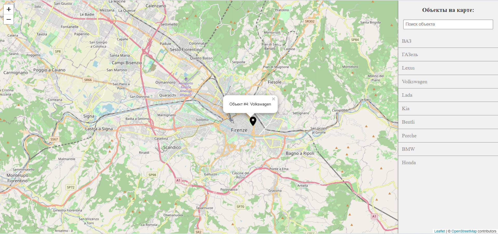

# Приложение по поиску объектов на карте #
### Описание
Приложение получает список объектов со сторонего сервера, отображает их в виде объектов на карте и списка ссылок на эти объекты,
при клике на которые пользователь перемещается по карте. В боковой панели, так же реализован поиск по наименованиям объектов.


### Технологии
- React
- Typescript
- Less
- Mobx
- Leaflet 

### Установка
- клонирование приложения командой
  ```bsh
  git clone 
- установка зависимостей
  ```js
  npm install
- запуск локального сервера
  ```js
  npm run start

### Дополнительно